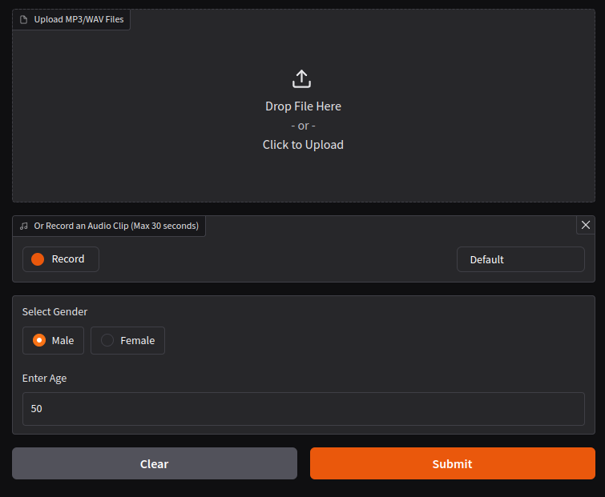
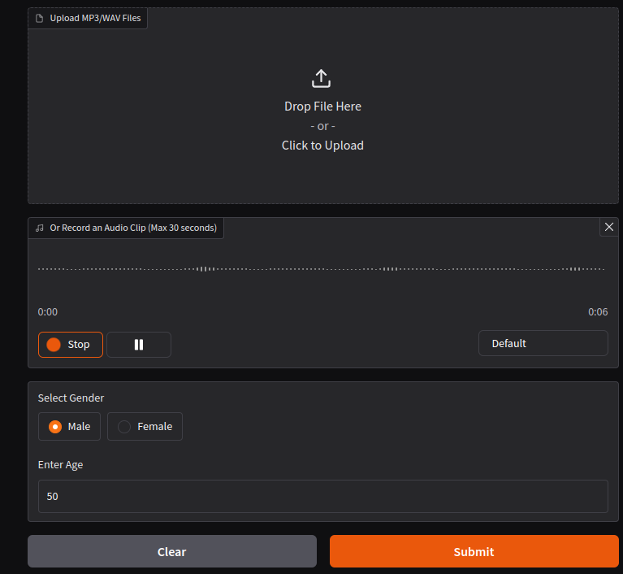
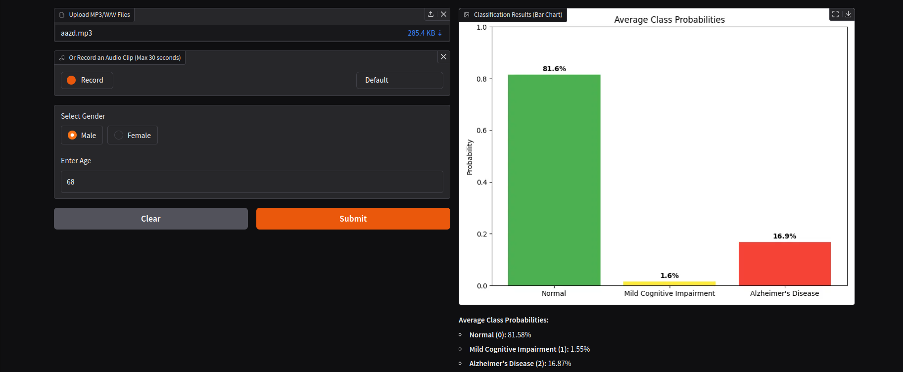

# Audio Classification App

This Gradio-based application classifies audio recordings into three categories: **Normal**, **Mild Cognitive Impairment (MCI)**, and **Alzheimer's Disease (AD)**. It provides an easy-to-use interface where users can upload audio files or record new ones, input age and gender, and get predictions along with probability charts and feature-based explainability.

---

## Features

- **Audio Input**:
  - Drag and Drop pre-recorded audio files.

  

  - or

  - Record new audio files directly using the app.

  

- **Additional Inputs**:
  - Age and gender fields to improve model accuracy.

- **Predictions**:
  - Classifies audio into **Normal**, **MCI**, or **AD**.
  - Displays probability charts for each class.

    

- **Explainability**:
  - Provides insights into how input features influenced predictions.

    

---

## Installation

Follow these steps to set up and run the application on your local machine:

### 1. Clone the Repository
```bash
git clone https://github.com/SiavashShirzad/PREPARE-Acoustic-Track-Competition
cd PREPARE-Acoustic-Track-Competition/Demo
pip install -r requirements.txt
python Demo.py
```

### Note

# The availble model was trained using CUDA and the Demo reqires cuda being enabled. If you need to use CPU a new model needs to be trained or the the setting of the model needs to change.
